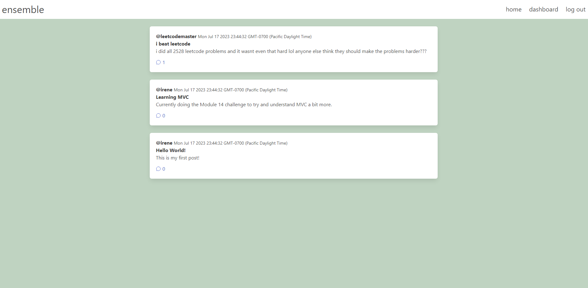

# Ensemble Blog Website

## Description

This is a work-in-progress blog application that allows users to post and see blog posts. Users can sign up for an account or log in.

## Usage/Preview

On the homepage, users will be able to see posts made by all users. In order to access their own posts on the dashboard, they must log in or sign up. The navigation bar offers quick access to the homepage, the dashboard, and the log in page.

Users can post new posts on the dashboard page, as well as edit and delete posts they've made. On the homepage, users can also add comments to other posts and see the comments posted by others.

Live: https://ensemble-blog-bfd105093377.herokuapp.com/ 

## Technologies Used
* Node.js
* Express.js
* Sequelize
* Handlebars.js
* Bulma

## Credits

Some designs provided by Bulma.

## License

N/A
